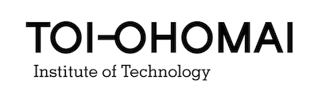

<link rel="stylesheet" href="../css/styles.css">

# COMP5007 Intro to Multimedia
## Semester 17B

## Assessment 2
## Milestone 1: Monday September 11th 2017 @ 4pm
## Milestone 2: Monday September 25th 2017 @ 4pm

### Submission: Git repository link pasted in Moodle
### Requirements: Knowledge of Learning outcome 1, 2 and 3
---

  
# Learning Outcomes

### Learning Outcome One:
Understand why interactive and animated multimedia applications solve problems of low complexity.

### Learning Outcome Two:
Understand and use key design principles of text, graphical images, video, animation and sound for multimedia content.

### Learning Outcome Three:
Create an interactive and animated multimedia application suitable for Web or mobile devices.

  
# Objective
This assessment requires you to create a website template which will test you on your skills as a "functional" designer and developer.

For this task you will need to use tools like Bootstrap and the MVC design framework.
This assessment is to be completed in a group and for you to collaborate together on the project.

You are to use git to manage your project and set out your milestones.

  
# Resources
There are 2 main resources that you need to look through to get a better understanding of what you need to do for this assessment.

* Create a default MVC project and disect how it is all put together.
* Look at some bootstrap websites and how they have been arranged. [Start Bootstrap](https://startbootstrap.com) is a good place to begin. You can download some templates and study them.

# Milestones

This Assessment has 2 milestones: 
* Milestone 1: Monday September 11th 2017 @ 4pm
* Milestone 2: Monday September 25th 2017 @ 4pm

**Milestone 1: Planning Report:**  

In this report you are to explain what your work process will be, what resources you have found that you think will help.

Also draw out a wireframe of your design, you will need to create about 6 pages each with a different layout. Each of these pages need to have a desktop / tablet and a mobile layout.

Also create a section on the tools you are using and why. Note that for communication you need to use Slack you will get a slack channel assigned to your team.

The report will need to show the delegated role for each team member. 

**Milestone 2: Website execution:**  

For this milestone you as a team need to submit the web template you have created.

You are to have a common theme amongst your pages.
Create a template page for the following items:

* 100% single column main home page
* Profile page for people that work at a business
* Portfolio page, something that can showcase a persons work - just image placeholders.
* A contact page, add a map and other relevant details that a company could use
* A blog type page with the option for a header and a body of a paragraph
* A media gallery that has a slideshow or a lightbox feature and responsive videos

Any data you use needs to be dummy data, use `lorem ipsum` text and placeholder images.
If you get your images / videos from anywhere, make sure they are referenced on a page on your website. (This could be a page called resource.html and needs to be a part of your theme.)

The pages in your project need to be linked to each other.

  

# Marking Guide:

## Milestone 1 - 30%

| Item 
 Description | Marks |
| :---: | --- |
| |
| 1 
  Team Roles Allocation (10 Marks) | **Individual Marks** 
 **10** Selected a leader, allocated sections to each person, setup a communication platform and structure. 
 **5** Selected a leader, not everyone knows what to do, kinda guessing, just using slack, but haven't evaluated any other tools to help with this project. 
 **0** No leader, no structure, nothing added to Slack |
| 2 
 Collected Resources (20 Marks) | **Individual Marks** 
 **10** Clearly listed a number of resources that you are planning to use during your assessment, they are referenced to the to original content. 
 **5** Vaguely an idea of what is being used, not at all or some resources are referenced 
 **0** No resources are set or no references supplied  |  | 
| 3 
 Wireframes (30 Marks) | **Individual Marks** 
 **10** 6 complete wireframes for each of the specified sizes, good detail and can clearly see what the template is going to look like 
 **5** Up to 3 - 5 complete wireframes or incomplete wireframes 
 **0** No wireframes or less than 3 supplied |
| 4 
 Tools (20 Marks) | **Individual Marks** 
 **10** Clearly show what tools you are using for your project. List a reason why you chose it and add the tutor to your team if possible. 
 **5** Just using slack, that is all we need. No effort in using other tools was made. 
 **0** Slack channel not used at all and no record of other communication has been presented. |
| 5 
 Journal Process (20 Marks) | **Individual Marks** 
 **10** Clearly show a history of the progress you are making with your team and a summary of the tools you chose and when they where selected. 
 **5** One entry in a journal form explaining the progress of the team and shows some sort of plan towards the practical project 
 **0** No journal supplied. |

# List of Resources:

> The MVC Framework (ASPNET CORE)  
https://www.youtube.com/playlist?list=PLs5n5nYB22fIqNHp8kHP6dLW5DZYJnWxz

> StartBootstrap  
https://startbootstrap.com

> Use Bootstrap  
https://getbootstrap.com

> Responsive Media  
https://getbootstrap.com/docs/3.3/components/#responsive-embed

# Marking Guide:

## Milestone 2 - 70%

| Item 
 Description | Marks | Marks Allocated | Comments | 
| :---: | --- | :---: | --- |
| | | |

TO BE RELEASED LATER