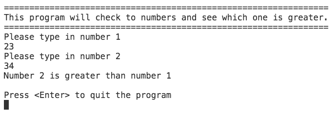
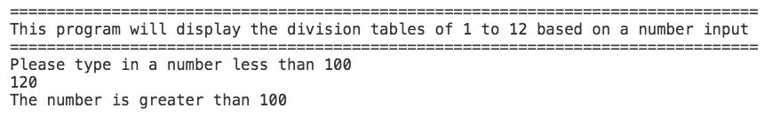

<link rel="stylesheet" href=".../../css/styles.css">

# COMP.5202 Fundamentals of Programming & Problem Solving
# Semester 2, 2017

<table>
    <tr>
        <th>Assessment	</th>
        <th>Type of Assessment</th>
        <th>Due</th>
        <th>Marks</th>
        <th>Weighting</th>
    </tr>
    <tr>
        <td>Test #1</td>
        <td>Practical programming test</td>
        <td>4 September 2017, 10:10am - 12:00pm</td>
        <td>100 Marks</td>
        <td>30%</td>
    </tr>
    <tr>
        <th colspan="5">
        Learning outcomes Assessed:
        </th>
    </tr>
    <tr>
        <td colspan="5">
        1. Apply programming concepts and tools to system management tasks
        </td>
    </tr>
    <tr>
        <td colspan="5">
        4. Demonstrate programming using core logic and mathematical concepts such as problem solving methods, critical thinking, abstract reasoning; and systems thinking.
        </td>
    </tr>
</table>

# Instructions

You have 105 minutes to complete this test.

This test is an individual practical test to be completed in class using Microsoft Visual Studio Code.

Please clarify any aspect of the test of which you are unsure of with your lecturer.  

You are required to create 4 repositories on Github and submit the links to those 4 repositories on Moodle.

For each problem you are required to create a flow diagram and add the relevant pseudocode.

>The names for the repositories should be in the follow format: 
`<student-id>-Task-Langauge`  
**For example: **
`9980349-problem01-csharp`
or 
`9980349-problem01-js`

**NOTE:  This assessment contributes to 30% to your overall grade in COMP.5202** 

1.	> Write a C# and Javascript program that compares 2 numbers by user input.  You will need to show the user if the number is `bigger`, `equal to` or `smaller` than each other  
    
    * Tell the user what the program is about
    * Ask the user for 2 numbers
    * Use a single `if` / `else` statement to workout what needs to be displayed to the user
    * Print the answer of the comparison to the user

    > ### Example Answer    

    ## Make sure to include:
    Make sure you include the following:
    * Clear pseudocode
    * Watch your syntax (casing and indentation)
    * If your program does not work, still push it up to GitHub
    
    ## For Javascript specifically:
    * Use ES6 syntax

2. > Write a C# and Javascript program that divides a number less than 100 by 12 and shows each division from 1 to 12 Use a loop to achieve this.  

    * Tell the user what the program is about
    * Ask the user for 1 number
    * Use a if statement to check if the number is less than 100
    * Use a loop to print out the 12 equations
    * Make sure the answer is displayed as a double so that the numbers can show decimal numbers.

    > ### Example Answer 01    
    
    > ### Example Answer 02    

    ## Make sure to include:
    Make sure you include the following:
    * Clear pseudocode
    * Watch your syntax (casing and indentation)
    * If your program does not work, still push it up to GitHub
    
    ## For Javascript specifically:
    * Use ES6 syntax
    * Print the answer to the `console` (do not use `alert()`)